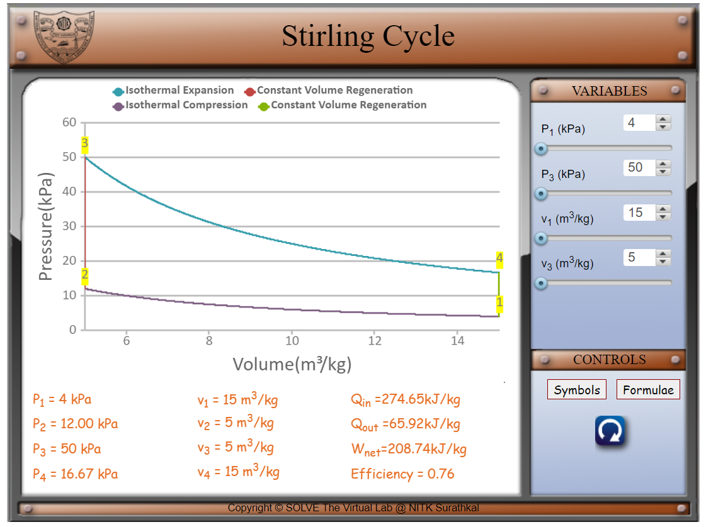
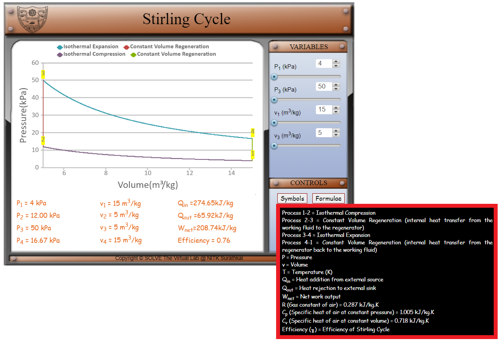
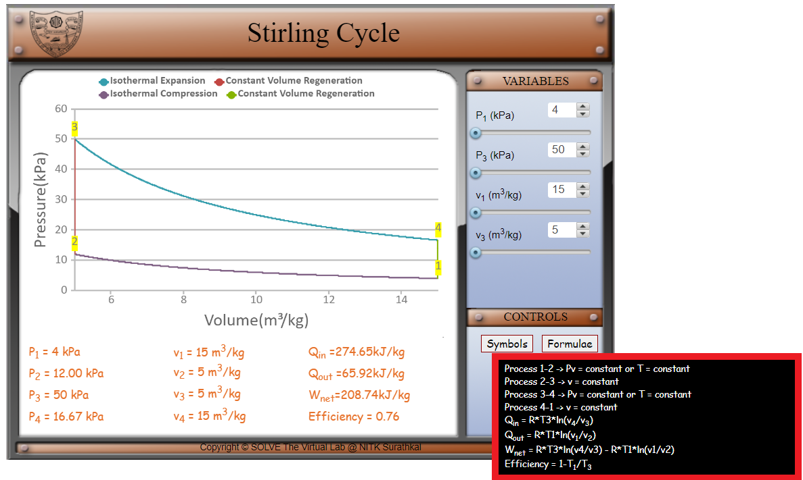
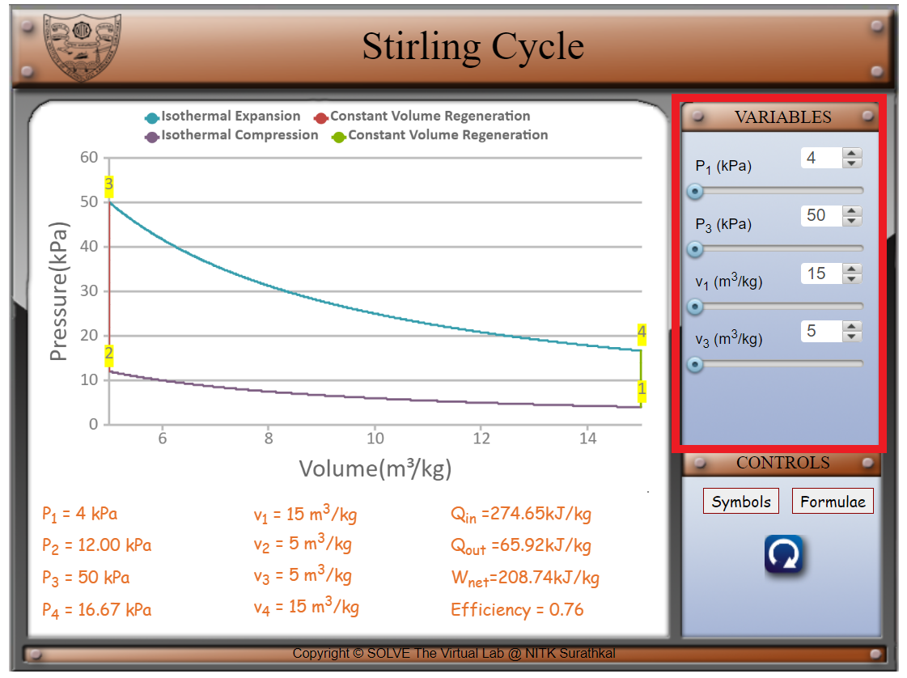
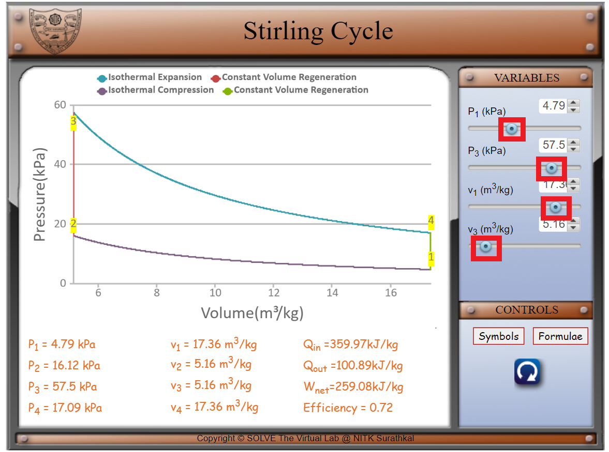
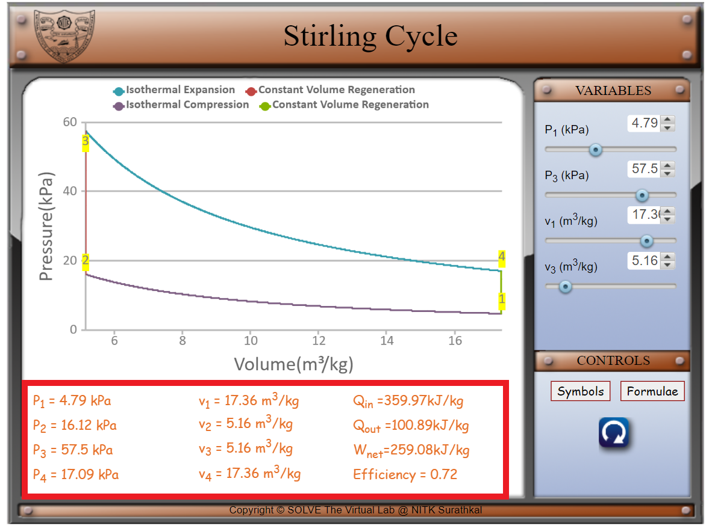
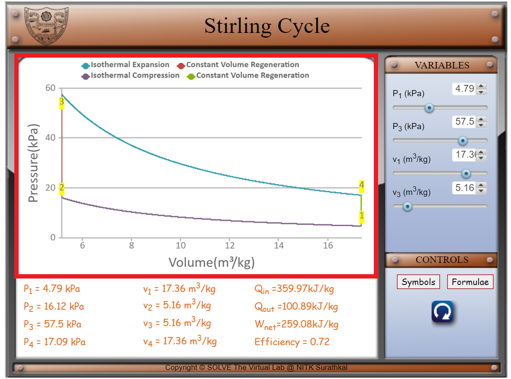

#### These procedure steps will be followed on the simulator

1. In the simulation window, the Stirling cycle graph is displayed.

 

2. The various symbols and the formulae involved in the experiment are displayed in the control panel when the cursor hovers over ‘Symbols’ and ‘Formulae’ respectively.

 

 

3. The parameters of the system can be changed by changing the variables as shown below. 

 

4. Move the knob of the sliders to vary the pressures P1 and P3, the volumes v1 and v3. P1 can be varied from 4 to 6 kPa. P3 can be varied from 50 to 60 kPa. v1 can be varied from 15 to 18 m3/kg. v3 can be varied from 5 to 6 m3/kg. 

 

5. P1, P2, P3, P4, v1, v2, v3, v4, Qin, Qout, Wnet and the efficiency are displayed at the bottom. 

 

6. Visualize the change in the graph as the various parameters are changed.

 
